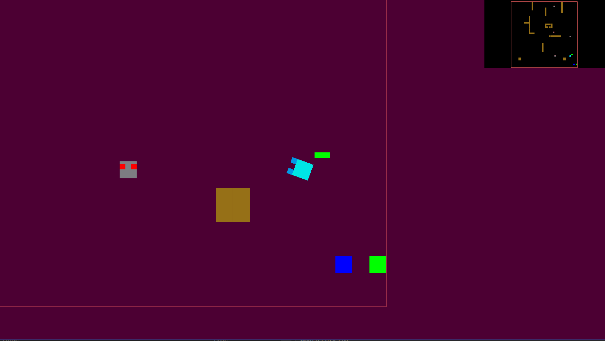
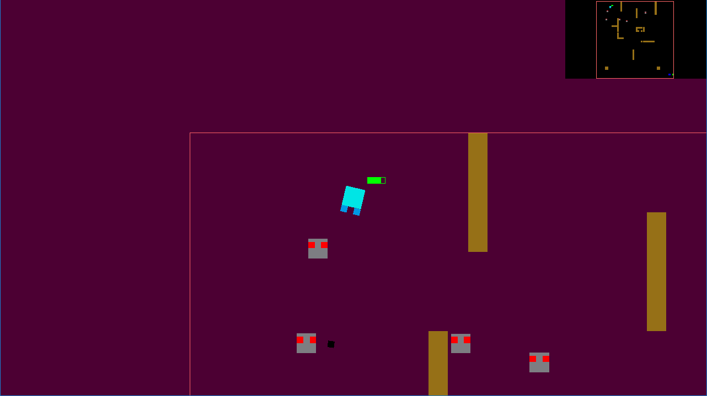
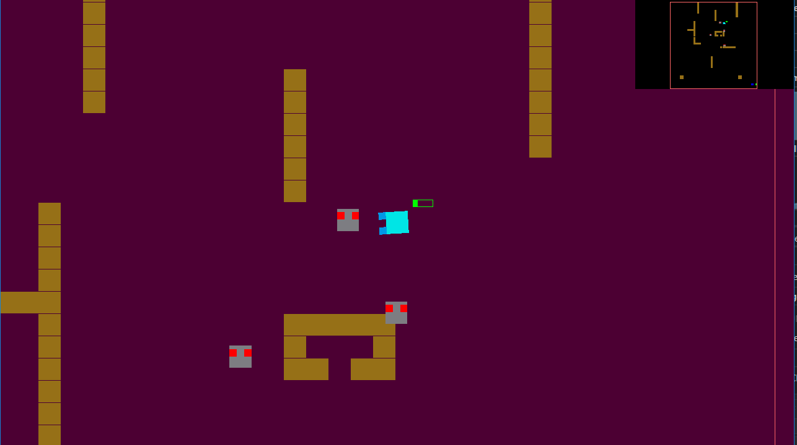

# surviv.io game in OpenGL and C++

## About

https://ocw.cs.pub.ro/courses/egc/teme/2021/01

Design a surviv.io kind of game using shape manipulations, game physics and movements

## Structure

### For creating the game I used the following files:

- tema1.cpp 

The whole computation part is done in this file with the using of the framework from the EGC team alongside the OpenGL libraries

- tema1.h & object2D.h & object2D.cpp

Adapted a laboratory and added functions to test if player/enemy alive, collision, movements, firing bullets, creating new shapes etc.

## Description of flow

- Hero

The hero is constructed using 3 meshes, each one of them being shown in the middle of the screen and rotating with the cursor like in top-down games. Each mesh is translated as soon as keyboard buttons are pressed to show movement. Hero also has health that gets diminuated if an enemy touches him and also a score, shown in the console at every kill he makes.

Hero gets blocked by obstacles and can fire 10 bullets, after all bullets are fired a 5s cooldown is applied.

- Enemy

Enemy is constructed using 3 meshes also, same on the hero happening with translation. He also has 2 fields named follow_x and follow_y which are
used to translate the Enemy to follow the hero. He follows the hero until dies from its bullet or until it hits him reflecting in a damage on the
hero's health. The enemy always follows the hero and know its location, also enemies dont get blocked by obstacles.

An enemy is randomly spawned on the map after 2 seconds, and all dead enemies are respawned after 5 seconds. This makes it harder for the hero
to keep up with them, coming in waves.

Enemies also have random speeds to speed up the game pressure.

- Obstacle

Obstacles are placed on map according to my choice of design, they reflecting a map with a fake safehouse (if the user gets inside, gets out hard
and the bullets are not that effective), and several shapes to make the gameplay harder and dynamic. User has to move in order to escape the enemies
and in order to not get stuck in the obstacles.

- Bullet

The bullets number are set on an AMMO define, by default being set at 10. This defined can be changed to reflect various situations. The bullet
is fired using the left mouse click, and follows the direction given by it at a certain distance. This means that after the bullet is shot, if it
doesn't hit an obstacle, the map grid or an enemy it dissapears.
Enemies hit by bullets die instantly, and obstacles hit by it absorb the bullet.
As said above, bullets have a cooldown in which after all bullets are shot, 5s remain for them to come back again.
Also, if the user shots 2 bullets, then after 5s all bullets are available again. This behaviour makes the user more strategic in choosing his tactic.

- Others

  - check_obstacle_collision(): tests if the hero or the bullets touch an obstacle, if so then they are stopped - can't go over the obstacle so they
need to move in another direction.

  - check_map_limits(): no instance can leave the map, and this function makes sure it is like that.

  - check_dead: check if enemies are dead from the bullets, then respawning flow is applied. If enemies are dead, they are not rendered on the screen.

  - implemented pickups for health giving a +50 health boost and a pickup for freezing enemies which sets all current enemies speed to 1.

  - implemented a minimap to show the full-size map in the left right corner.

